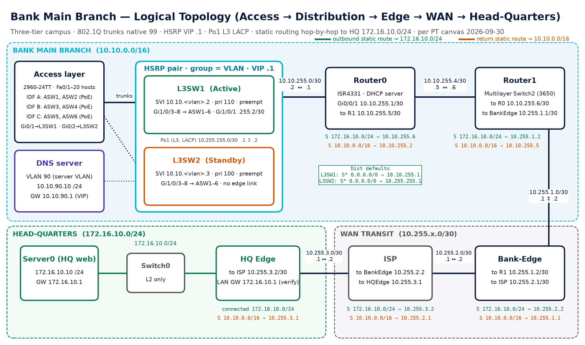
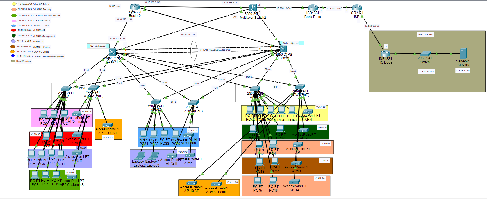
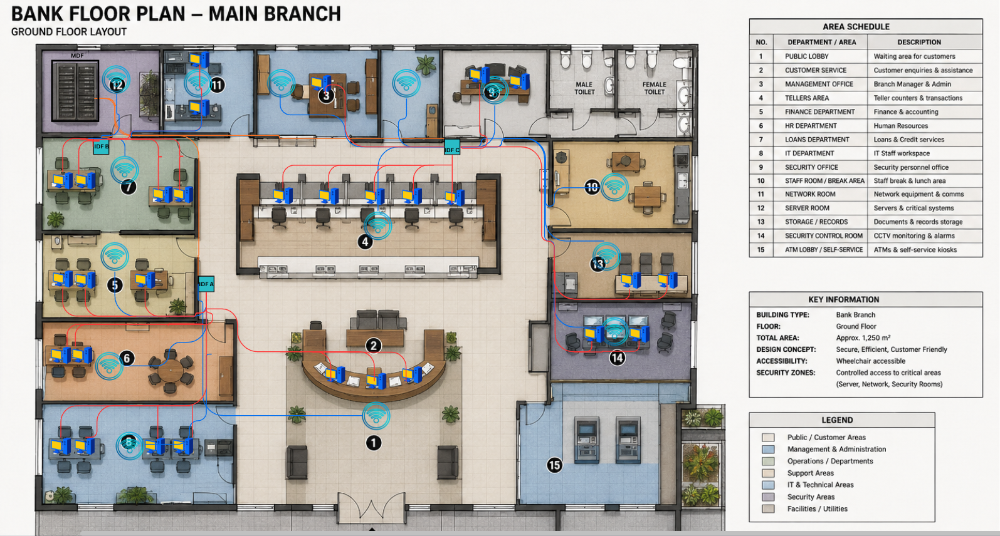
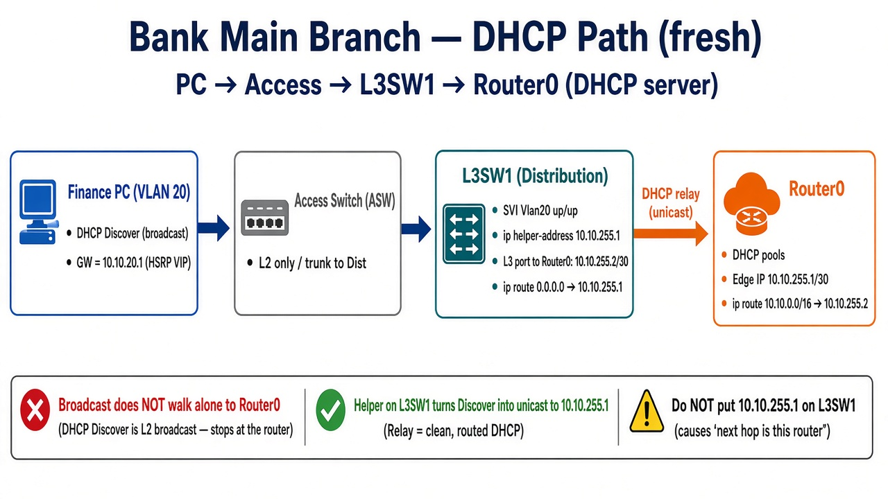

# Bank Main Branch Network (Cisco Packet Tracer)

A three-tier bank branch campus designed and built in Cisco Packet Tracer by two people, split by layer: six access switches in three IDFs, a redundant distribution pair with HSRP, a single DHCP server on the edge router, and static routing out to a Head-Quarters web server.

> **This is a home-lab project.** Every device lives in Packet Tracer. The INC/TKT numbers are lab and NOC-drill tickets from a simulated bank, not incidents at a real employer.

| | |
|---|---|
| **Built by** | [Innocent (Nkosiyethu) Mbatha](https://www.linkedin.com/in/innocent-mbatha-366446247/) (Layer 3 & 7) and Nondumiso Mbuyazi (Layer 2 & 3) |
| **Tool** | Cisco Packet Tracer |
| **Design revision** | Master Document Rev 1.0, 30 Sep 2026 ([PDF, 27 pages](docs/Bank_Main_Branch_Network_Design_Master.pdf)) |
| **Status** | Design locked. Two incidents resolved. Failover and HQ-path tests still to run (see [Roadmap](#roadmap)). |

---

## Contents

- [Topology](#topology)
- [VLAN and addressing plan](#vlan-and-addressing-plan)
- [HSRP design](#hsrp-design)
- [DHCP on Router0](#dhcp-on-router0)
- [Static routing (internal and to HQ)](#static-routing-internal-and-to-hq)
- [DNS](#dns)
- [Troubleshooting wins](#troubleshooting-wins)
- [Verification commands](#verification-commands)
- [Known issues](#known-issues)
- [Roadmap](#roadmap)
- [Repository layout](#repository-layout)
- [Credits](#credits)

---

## Topology



| Tier | Devices | Role |
|---|---|---|
| Access | ASW1–ASW6 (2960-24TT), 2 per IDF (A, B, C) | End devices on Fa0/1–20. Every ASW is dual-homed: Gi0/1 to L3SW1, Gi0/2 to L3SW2 (802.1Q, native VLAN 99) |
| Distribution | L3SW1 / L3SW2 (3650-24PS) in the MDF | SVI gateways with HSRP, DHCP relay, inter-VLAN routing. Joined by **Po1**, a routed L3 EtherChannel (LACP, Gi1/0/23–24, 10.255.255.0/30) |
| Edge | Router0 (ISR4331), Router1 (3650 used as a routed hop) | Router0 is the campus edge and the **only DHCP server** |
| WAN / HQ | Bank-Edge, ISP, HQ Edge (ISR4331), Switch0, Server0 | Static path to the HQ LAN 172.16.10.0/24 and Server0 **172.16.10.10** |

Branch → HQ path (design):
`host → VIP 10.10.<vlan>.1 (L3SW1) → Router0 10.10.255.1 → Router1 10.10.255.6 → Bank-Edge 10.255.1.2 → ISP 10.255.2.2 → HQ Edge 10.255.3.2 → Server0 172.16.10.10`

<details>
<summary>Packet Tracer canvas (30 Sep 2026) and floor plan</summary>





</details>

---

## VLAN and addressing plan

One VLAN and one /24 per department. VLAN 99 is the trunk native VLAN only (no SVI, no HSRP, no DHCP).

| VLAN | Name | Subnet | Gateway (HSRP VIP) | L3SW1 | L3SW2 | DHCP pool (Router0) |
|---|---|---|---|---|---|---|
| 10 | MANAGEMENT | 10.10.10.0/24 | 10.10.10.1 | .2 | .3 | VLAN10_MGMT |
| 20 | FINANCE | 10.10.20.0/24 | 10.10.20.1 | .2 | .3 | VLAN20_FINANCE |
| 30 | HR | 10.10.30.0/24 | 10.10.30.1 | .2 | .3 | VLAN30_HR |
| 40 | IT | 10.10.40.0/24 | 10.10.40.1 | .2 | .3 | VLAN40_IT |
| 50 | TELLERS | 10.10.50.0/24 | 10.10.50.1 | .2 | .3 | VLAN50_TELLERS |
| 60 | CUSTOMER_SERVICE | 10.10.60.0/24 | 10.10.60.1 | .2 | .3 | VLAN60_CUSTSVC |
| 70 | LOANS | 10.10.70.0/24 | 10.10.70.1 | .2 | .3 | VLAN70_LOANS |
| 80 | SECURITY | 10.10.80.0/24 | 10.10.80.1 | .2 | .3 | VLAN80_SECURITY |
| 90 | STORAGE_SERVERS | 10.10.90.0/24 | 10.10.90.1 | .2 | .3 | VLAN90_SERVERS |
| 100 | GUEST | 10.10.100.0/24 | 10.10.100.1 | .2 | .3 | VLAN100_WIFI |
| 99 | NATIVE | trunk native only | – | – | – | none |

Point-to-point links:

| Link | Subnet | Side A | Side B |
|---|---|---|---|
| Router0 ↔ L3SW1 (edge) | 10.10.255.0/30 | Router0 Gi0/0/1 .1 | L3SW1 Gi1/0/1 .2 |
| Router0 ↔ Router1 | 10.10.255.4/30 | Router0 .5 | Router1 .6 |
| Router1 ↔ Bank-Edge | 10.255.1.0/30 | .1 | .2 |
| Bank-Edge ↔ ISP | 10.255.2.0/30 | .1 | .2 |
| ISP ↔ HQ Edge | 10.255.3.0/30 | .1 | .2 |
| L3SW1 ↔ L3SW2 (Po1, L3 LACP) | 10.255.255.0/30 | L3SW1 .1 | L3SW2 .2 |
| HQ LAN | 172.16.10.0/24 | HQ Edge .1 (to verify) | Server0 .10 |

---

## HSRP design

Every user VLAN has one virtual gateway, so a PC never needs to know which distribution switch is up.

| Parameter | Value | Why |
|---|---|---|
| Group | = VLAN ID | `show standby brief` maps 1:1 to VLANs |
| Virtual IP | **10.10.&lt;vlan&gt;.1** | The only gateway hosts ever see; it's also the DHCP `default-router` |
| L3SW1 | .2, priority 110, preempt | Deterministic **Active**; takes the role back after recovery |
| L3SW2 | .3, priority 100, preempt | **Standby** |
| Timers | HSRP v1 defaults (hello 3 s, hold 10 s) | |
| Rule | No SVI ever holds .1 as its real IP | A real .1 fights the VIP (see [Known issues](#known-issues)) |

```ios
! L3SW1 - Active (VLAN 20 pattern)          ! L3SW2 - Standby
interface Vlan20                            interface Vlan20
 ip address 10.10.20.2 255.255.255.0         ip address 10.10.20.3 255.255.255.0
 ip helper-address 10.10.255.1               ip helper-address 10.10.255.1
 standby 20 ip 10.10.20.1                    standby 20 ip 10.10.20.1
 standby 20 priority 110                     standby 20 priority 100
 standby 20 preempt                          standby 20 preempt
```

Design note: Po1 is a *routed* link, so HSRP hellos between the pair cross the dual-homed access trunks, not Po1.

Known design limit: Router0's only edge link is on L3SW1. If the whole of L3SW1 fails, the VIP survives on L3SW2 but DHCP and the route to HQ go with L3SW1.

---

## DHCP on Router0

- **Router0 is the only DHCP server.** One pool per user VLAN, `default-router` = the VLAN's VIP.
- Exclusions `.1–.10` per VLAN (VIP, both SVIs, infrastructure). VLAN 90 excludes `.1–.49` for static servers.
- The distribution switches relay with `ip helper-address 10.10.255.1` on every user SVI. That's Router0's address on the **Dist → Router0 /30** (10.10.255.0/30).
- The relay sets `giaddr` to the SVI address; Router0 picks the pool that contains it and replies via its `10.10.0.0/16` return route.
- No pool for VLAN 99.

```ios
! Router0 (VLAN 20 shown; full set in configs/target-state/Router0.txt)
ip dhcp excluded-address 10.10.20.1 10.10.20.10
ip dhcp pool VLAN20_FINANCE
 network 10.10.20.0 255.255.255.0
 default-router 10.10.20.1
 dns-server 10.10.90.10 8.8.8.8
```



---

## Static routing (internal and to HQ)

No OSPF/EIGRP in this revision. Static routes only, so every hop carries **two** routes: `172.16.10.0/24` outbound and `10.10.0.0/16` for the return trip.

| Device | Destination | Next hop | Purpose |
|---|---|---|---|
| L3SW1 | 0.0.0.0/0 | 10.10.255.1 (Router0) | Outside / HQ |
| L3SW2 | 0.0.0.0/0 | 10.255.255.1 (L3SW1 Po1) | Outside / HQ (L3SW2 has no link in the edge /30) |
| Router0 | 10.10.0.0/16, 10.255.255.0/30 | 10.10.255.2 (L3SW1) | Return to the branch and to Po1 |
| Router0 | 172.16.10.0/24 | 10.10.255.6 (Router1) | Outbound to HQ |
| Router1 | 172.16.10.0/24 · 10.10.0.0/16 | 10.255.1.2 · 10.10.255.5 | Outbound · return |
| Bank-Edge | 172.16.10.0/24 · 10.10.0.0/16 | 10.255.2.2 · 10.255.1.1 | Outbound · return |
| ISP | 172.16.10.0/24 · 10.10.0.0/16 | 10.255.3.2 · 10.255.2.1 | Outbound · return |
| HQ Edge | 10.10.0.0/16 · 0.0.0.0/0 | 10.255.3.1 | Return · default |

Inside the branch, `ip routing` on both distribution switches makes every SVI a connected route, so inter-VLAN traffic is routed on the Active switch.

Lesson learned: pointing a default route at an address the switch already owns gives `%Invalid next hop address (it's this router)`. The next hop has to be a neighbour on a connected subnet. ([write-up](troubleshooting/LESSON-01-invalid-next-hop.md))

---

## DNS

- Branch DNS server: Server-PT **10.10.90.10** in VLAN 90, static, gateway 10.10.90.1 (the VIP, so it survives a gateway failover).
- Design: every pool hands out `dns-server 10.10.90.10 8.8.8.8`. 8.8.8.8 is a secondary entry with no internet path in the lab.
- Records on the live server: `router0 → 10.10.255.1`, plus one test record that needs renaming (see [Known issues](#known-issues)). `hq-web.bank.com → 172.16.10.10` is planned once the HQ path is proven.

---

## Troubleshooting wins

Two lab incidents, each worked fault → diagnose → fix → verify. Full write-ups in [`troubleshooting/`](troubleshooting/).

### INC-2101: Finance VLAN 20 lost its gateway (HSRP)

**Fault:** Finance PCs showed Limited/No connectivity. HR (VLAN 30) next door was fine, so it wasn't a campus-wide outage.
**Diagnose:** I compared a broken Finance host with a working HR host, then checked the distribution layer first (SVI, `show standby brief`, VIP) instead of changing access ports. HSRP group 20 was stuck in Init: both switches had priority 110, and the VLAN 20 hellos weren't reaching the peer over the trunks.
**Fix:** L3SW1 .2, priority 110, preempt (Active). L3SW2 .3, priority 100, preempt (Standby). VIP 10.10.20.1. Trunks carrying VLAN 20 restored.
**Verify:** `show standby brief` Active/Standby on both; Finance PC pings 10.10.20.1; HR still healthy.
→ [INC-2101 write-up](troubleshooting/INC-2101-finance-vlan20-hsrp.md) · [L3SW1 capture](screenshots/01-L3SW1-hsrp-svis-2026-09-16.webp)

### TKT-2104: VIP reachable, but no DHCP leases (relay path)

**Fault:** After the gateway came back, Finance (PC19) and Tellers (VLAN 50) still sat on APIPA. The VIP answered pings; DHCP Discover never became an Offer.
**Diagnose (in order):** ping Router0 `10.10.255.1` from the Dist to prove the L3 path → check `ip helper-address` on the SVI → check the Router0 pool and its `default-router` → only then renew the client.
**Fix:** Brought up the Dist → Router0 /30 (Router0 .1 ↔ L3SW1 .2), added `ip helper-address 10.10.255.1` on the Dist SVIs, one Router0 pool per VLAN with the VIP as `default-router` and `.1–.10` excluded.
**Verify:** client got IP, mask, VIP gateway and DNS; Router0 `show ip dhcp binding` lists the Finance 10.10.20.x leases.
→ [TKT-2104 write-up](troubleshooting/TKT-2104-dhcp-relay.md) · [Router0 bindings capture](screenshots/03-Router0-dhcp-bindings-2026-09-16.webp)

---

## Verification commands

| Check | Where | Command | Expect |
|---|---|---|---|
| HSRP state | L3SW1, L3SW2 | `show standby brief` | One group per VLAN; L3SW1 Active pri 110 P, L3SW2 Standby pri 100 P, VIP .1 |
| SVIs up | L3SW1, L3SW2 | `show ip interface brief \| include Vlan` | Vlan10–100 up/up with .2 / .3 |
| Relay on an SVI | L3SW1, L3SW2 | `show run interface Vlan20` | `ip helper-address 10.10.255.1` |
| Edge path | L3SW1 | `ping 10.10.255.1` | Replies from Router0 |
| Pools / leases | Router0 | `show ip dhcp pool` · `show ip dhcp binding` | A pool per VLAN; bindings outside excluded ranges |
| DNS in pools | Router0 | `show run \| include dns-server` | `10.10.90.10 8.8.8.8` on every pool |
| Routes | every hop | `show ip route` | Entries as in the routing table above |
| Po1 | L3SW1, L3SW2 | `show etherchannel summary` | Po1(RU), Gi1/0/23–24 (P) |
| Trunks | ASW1–6, Dist | `show interfaces trunk` | Native 99, same allowed list both ends |
| Client | PC | `ipconfig /renew` · `ping 10.10.20.1` · `nslookup router0` | DHCP address, VIP replies, 10.10.90.10 answers |
| HQ path | Finance PC | `ping 172.16.10.10` · `tracert 172.16.10.10` | **Not yet run** (see Roadmap) |

The full 18-test plan (T01–T18) is in [`docs/test-plan.md`](docs/test-plan.md). The result column is still empty: results go in only after a test has been run on the live file.

---

## Known issues

The live lab isn't a clean as-built yet. From the 16 Sep 2026 live extract:

| # | Issue | Ticket | Status |
|---|---|---|---|
| 1 | **VLAN 60:** L3SW2 Vlan60 uses 10.10.60.1 (the VIP) as its real IP, with no `standby 60`. Gateway conflict for Customer Service. Visible in [this capture](screenshots/02-L3SW2-svis-po1-2026-09-16.webp). | TKT-2109 | Open |
| 2 | **VLAN 30 pool** on Router0 has no `dns-server` line, so HR clients get no DNS. | – | Open |
| 3 | **Duplicate `vlan40_IT` pool** on Router0 alongside the planned pool. | – | Open |
| 4 | **Router0 Gi0/0/1 description** still says "to L3SW2"; the live peer is L3SW1. | – | Open |
| 5 | DNS servers aren't the same on every pool yet (design: `10.10.90.10 8.8.8.8`). | TKT-2110 | Open |
| 6 | DHCP helpers are mainly on L3SW1; DHCP while L3SW2 is Active is unproven. | TKT-2111 | Open |
| 7 | VLAN 80 pool `default-router` doesn't match VIP 10.10.80.1. | TKT-2113 | Open |
| 8 | DNS test record `inno@bank.com` is not a valid hostname (`@`); rename to e.g. `inno.bank.com`. | – | Open |
| 9 | Design limit: Router0's only edge link is on L3SW1 (single point of failure for DHCP and HQ). | – | By design in Rev 1.0 |

The configs in [`configs/target-state/`](configs/target-state/) are the **target** design from the master document, not an export of the live running-config. Where they differ from the live lab, the table above is the difference.

---

## Roadmap

Tests that are planned but **not done yet**. No results are claimed for any of them.

- [ ] **TKT-2105: HSRP failover on Finance VLAN 20.** Continuous ping to 10.10.20.1, shut L3SW1 Vlan20, confirm L3SW2 goes Active, then `no shutdown` and confirm preempt (T15, T17). Record it.
- [ ] **T11 / T12: HQ reachability.** `ping` and `tracert 172.16.10.10` from a Finance PC (closes TKT-2114 proof).
- [ ] **TKT-2115: standby Dist missing its outside route.** HQ only works while L3SW1 is Active. Apply `ip route 0.0.0.0 0.0.0.0 10.255.255.1` on L3SW2, then re-test HQ during failover. Also check the return path while L3SW1 Vlan20 is shut.
- [ ] TKT-2111: helpers on every L3SW2 SVI; renew a lease during failover (T16).
- [ ] Fix known issues 1–8 and re-capture the screenshots.
- [ ] Export an updated `.pkt` that matches the 30 Sep design (HQ on 172.16.10.0/24).
- [ ] Fill in the result column of the test plan.
- [ ] Later revision: replace the static routes with OSPF and compare.

---

## Repository layout

```
.
├── README.md
├── configs/
│   └── target-state/          # per-device target configs (Master Doc Appendix A)
├── docs/
│   ├── Bank_Main_Branch_Network_Design_Master.pdf
│   ├── L2-L3-Command-Book_Nondumiso-Mbuyazi.pdf
│   └── test-plan.md
├── diagrams/                  # logical topology, PT canvas, floor plan, DHCP path
├── screenshots/               # live CLI captures, 16 Sep 2026
├── troubleshooting/           # INC-2101, TKT-2104, lesson learned, open tickets
└── packet-tracer/
    └── bank-main-branch_2026-09-18.pkt
```

The `.pkt` opens in Cisco Packet Tracer 8.x. It's the 18 Sep 2026 live file, so it **predates** the HQ readdressing to 172.16.10.0/24 and still has the known issues listed above.

---

## Credits

| Who | Layer | What they built |
|---|---|---|
| **Nondumiso Mbuyazi** | Layer 2 & 3 | VLAN database on all eight switches, access ports, 12 dual-homed 802.1Q trunks (native 99), PortFast + BPDU Guard, **the SVIs on the distribution pair**, **the routed L3 EtherChannel Po1 (LACP)**, VLAN colour scheme and floor-plan integration. Her [command book](docs/L2-L3-Command-Book_Nondumiso-Mbuyazi.pdf). |
| **Innocent (Nkosiyethu) Mbatha** | Layer 3 & 7 | **HSRP** gateways for the 10 user VLANs (VLAN 60 fix still open), **DHCP on Router0** with relays, **static routing** inside the branch and to HQ, **DNS**. Incident write-ups and the test plan. |

Built with Cisco Packet Tracer. Device names and the "bank" are fictional.

---

**About me:** I'm Innocent (Nkosiyethu) Mbatha, a career-changer into IT based in Mbombela, South Africa. CCNA candidate, Linux Essentials held. I'm looking for helpdesk, network technician and junior NOC roles. [LinkedIn](https://www.linkedin.com/in/innocent-mbatha-366446247/) · [GitHub](https://github.com/Nkosiyethu95)
